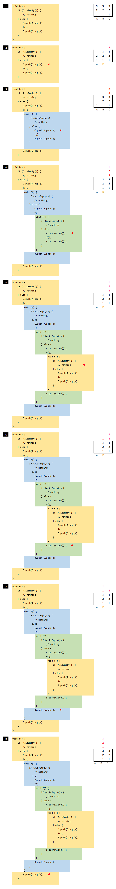

# recursive.stack
スタックに対して再帰呼び出しで Pop と Shift を繰り返すコード

変数 A, B, C はいずれも、スタックのデータ構造です。

```java
void f() {
    if (A.isEmpty()) {
        // nothing
    } else {
        C.push(A.pop());
        f();
        B.push(C.pop());
    }
}
```

再帰呼び出しの動きを表すと、以下のイメージになる。

  
